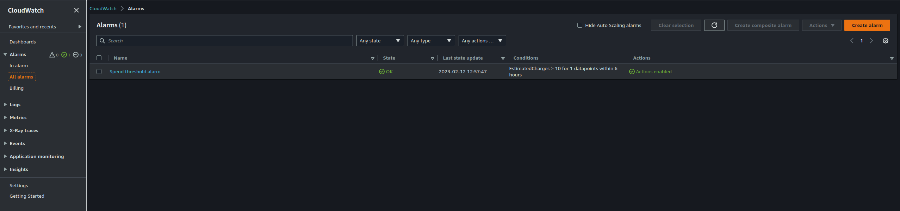
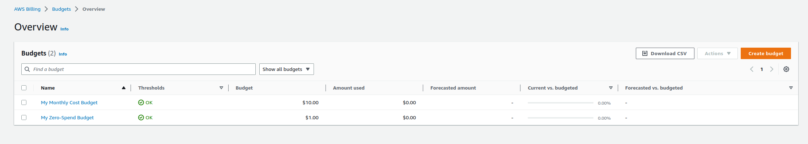
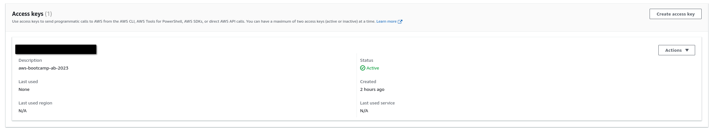
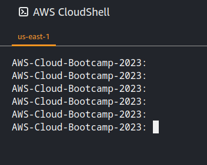
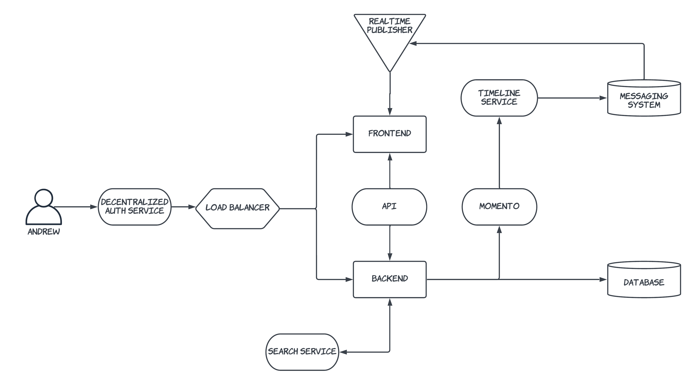
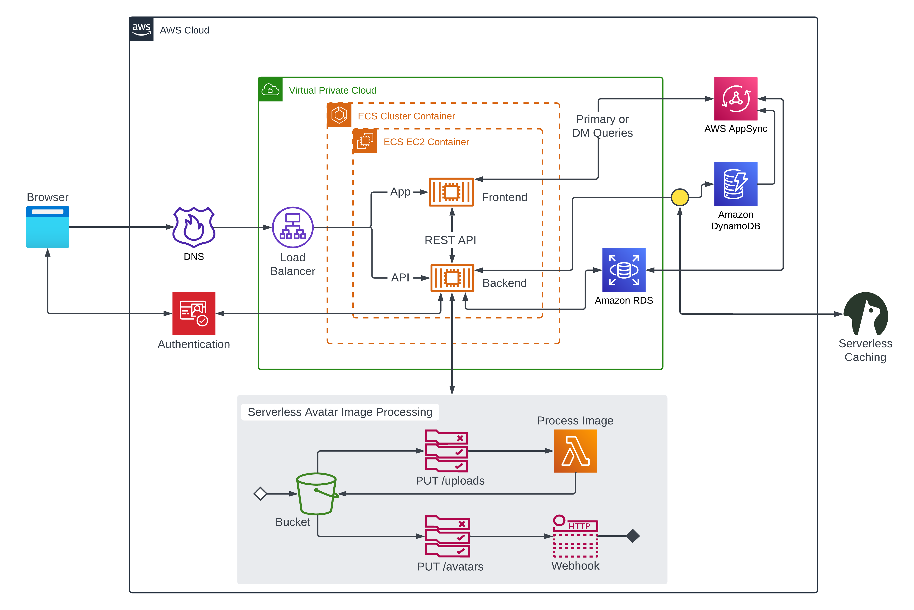

# Week 0 — Billing and Architecture

## Homework Hard Assignments

- Set a Billing Alarm
- Set an AWS Budget
- Generating AWS Credentials
- Using CloudShell
- Conceptual Architecture Diagram or your Napkins

### Set a Billing Alarm

Status: Done :heavy_check_mark:

### Set an AWS Budget

Status: Done :heavy_check_mark:

### Generating AWS Credentials

Status: Done :heavy_check_mark:

### Using CloudShell

Status: Done :heavy_check_mark:

### Conceptual Architecture Diagram or your Napkins

Status: Done :heavy_check_mark:

**[Conceptual Diagram](https://lucid.app/lucidchart/e3610c8a-43b0-4f2f-93cf-d22b8ec6e152/edit?invitationId=inv_85a2d681-7162-42f2-8318-8482e2a31ae1)**

**[Logical Diagram](https://lucid.app/lucidchart/f5ad0791-281b-478b-a414-629691ef428a/edit?invitationId=inv_9304a948-8695-44ee-971f-b6ee4915026b)**

