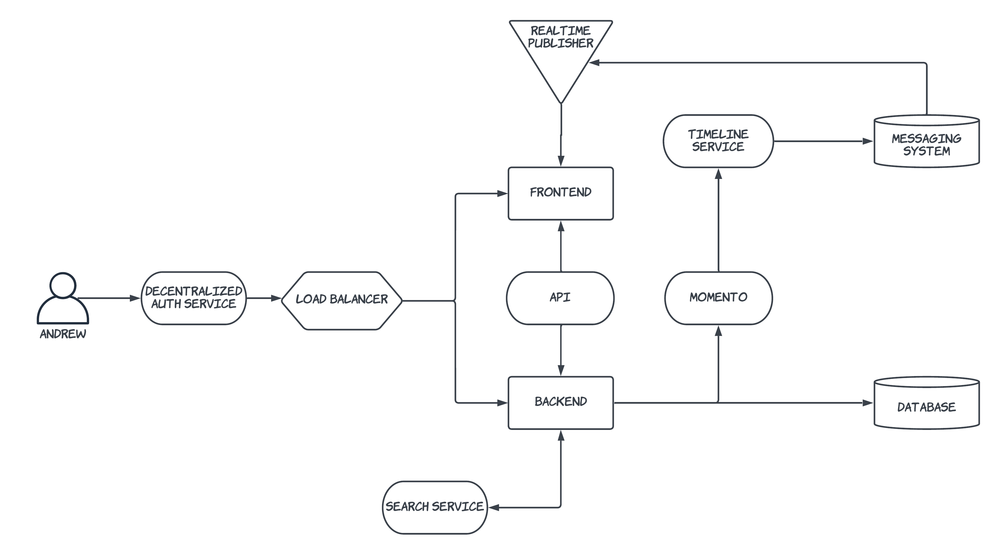

# Week 0 - Billing and Architecture

## Homework Hard Assignments

- Watched Week 0 - Live Streamed Video :heavy_check_mark:
- Watched Chirag's Week 0 - Spend Considerations :heavy_check_mark:
- Watched Ashish's Week 0 - Security Considerations :heavy_check_mark:
- Recreate Conceptual Diagram in Lucid Charts or on a Napkin :heavy_check_mark:
- Recreate Logical Architectural Diagram in Lucid Charts :heavy_check_mark:
- Create an Admin User :heavy_check_mark:
- Use CloudShell :heavy_check_mark:
- Generate AWS Credentials :heavy_check_mark:
- Installed AWS CLI :heavy_check_mark:
- Create a Billing Alarm :heavy_check_mark:
- Create a Budget :heavy_check_mark:

### Recreate Conceptual Diagram in Lucid Charts or on a Napkin

**[Conceptual Diagram](https://lucid.app/lucidchart/e3610c8a-43b0-4f2f-93cf-d22b8ec6e152/edit?invitationId=inv_85a2d681-7162-42f2-8318-8482e2a31ae1)**

### Recreate Logical Architectural Diagram in Lucid Charts

**[Logical Diagram](https://lucid.app/lucidchart/f5ad0791-281b-478b-a414-629691ef428a/edit?invitationId=inv_9304a948-8695-44ee-971f-b6ee4915026b)**

### Create an Admin User

### Using CloudShell

### Generating AWS Credentials

### Installed AWS CLI

### Create a Billing Alarm

### Create a Budget

